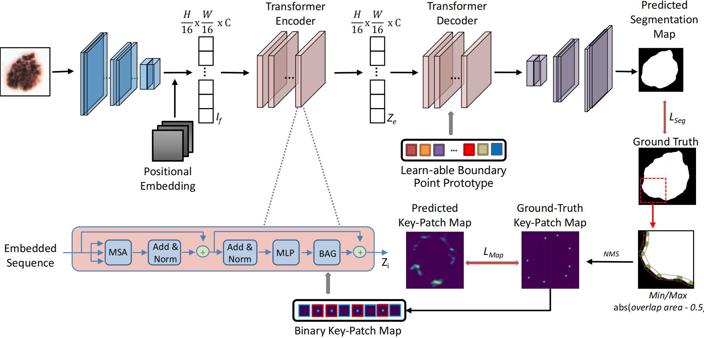

# Boundary-aware Transformers for Skin Lesion Segmentation

Recently, transformers have been proposed as a promising tool for global context modeling by employing a powerful global attention mechanism, but one of
their main shortcomings when applied to segmentation tasks is that they cannot effectively extract sufficient local details to tackle ambiguous boundaries. We propose a novel boundary-aware transformer (BAT) to comprehensively address the challenges of automatic skin lesion segmentation.

This paper has been accepted by MICCAI.


Fig. 1. Structure of BAT.

## Message
Sry for the delay！！！Orz Orz Orz Orz
After the covid-19, I'll go to the laboratory and upload my project!

## Code List

- [x] Network
- [ ] Pre-processing
- [ ] Training Codes
- [ ] MS

## Usage

1. First, you can download the dataset from [ISIC](https://www.isic-archive.com/) challenge.

2. Second, for pre-processing the dataset, you can run:

```bash
$ python src/resize.py
$ python src/point_gen.py
```

3. Third, before running the network, you should first download the code of [CELL_DETR](https://github.com/ChristophReich1996/Cell-DETR) into [lib](https://github.com/jcwang123/BA-Transformer/lib) and install it.

4. In the end, for testing the model, you could run:

```bash
$ python net/trans_deeplab.py
```

## TODO

We will update the latest training version under the same setting as [CA-Net](https://github.com/HiLab-git/CA-Net).

## Citation
